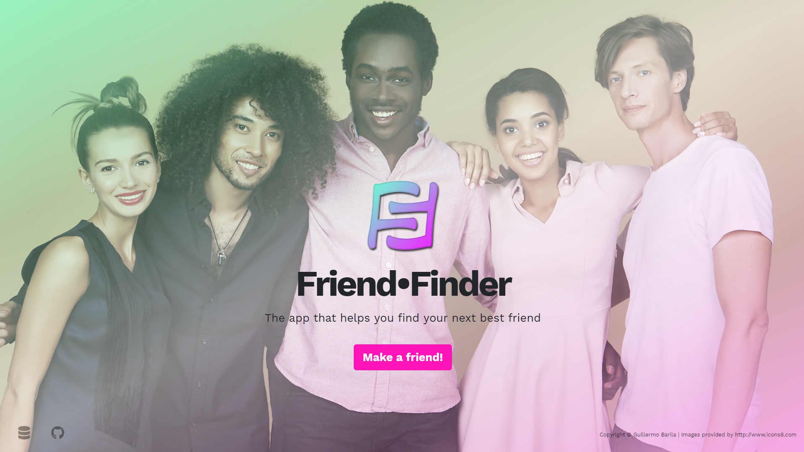
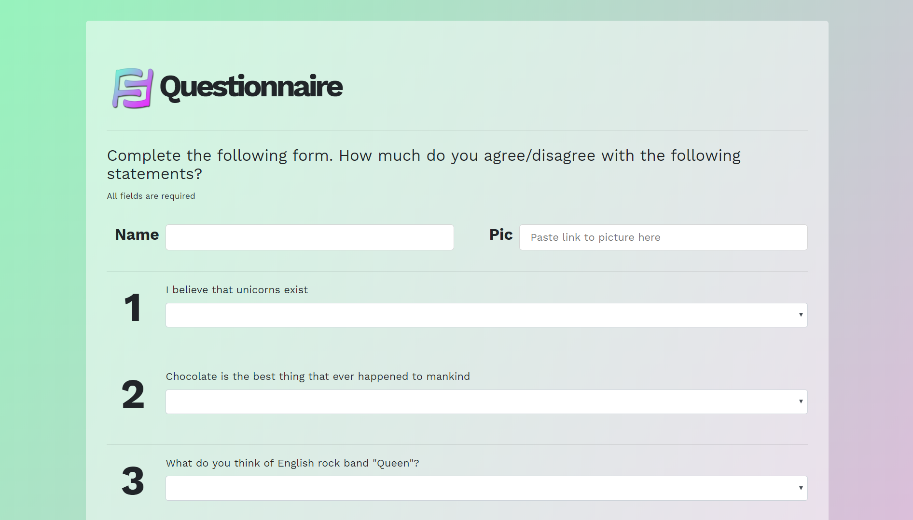
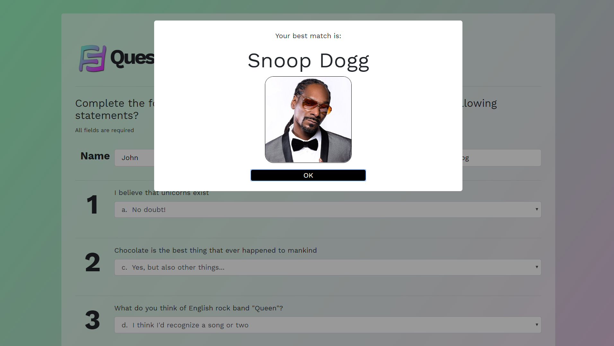

# Friend•Finder App

This project was the homework for week 13 of the Penn Coding Boot Camp.

## Goal
To create a full-stack application using NodeJS, ExpressJS and Heroku (for deployment).

## Installation and Set-up
Make sure to run *npm install* at the root directory after cloning the project. Then in the command line, run either `node server.js` or `npm start`, and direct your browser to `localhost:3000`.
You can also use the deployed version of this app at: https://gbarila-ffinder.herokuapp.com/.

## Functionality
The application consists of a land page (Picture 1) and a survey page (Picture 2) which contains a questionnaire with 10 questions. The user enters his name and a link to his picture, and answers the questions according to how much he agrees/disagrees with each statement. Once the user hits the **Done** button, the information from the form is sent to the server where a calculation is performed, and information is sent back to the client announcing who their best match is (Picture 3).

|    |     |
|----|-----|
| Picture 1. The land page of the Friend•Finder app.| Picture 2. The survey page and the questionnaire. |
|  Picture 3. After the **Done** button is clicked, the app will reveal your best match. |  |

## Objective
* To create a server using ExpressJS that will route html traffic by processing GET requests, and store and process data with POST requests.
* To create a full-stack application using html, CSS, Bootstrap, JavaScript/jQuery and NodeJS.

## Built using:
* HTML
* CSS
* Bootstrap
* vex
* git
* GitHub
* Heroku
* JavaScript
* jQuery
* NodeJS
* ExpressJS

## Authors
**Guillermo Barila** - *Author*